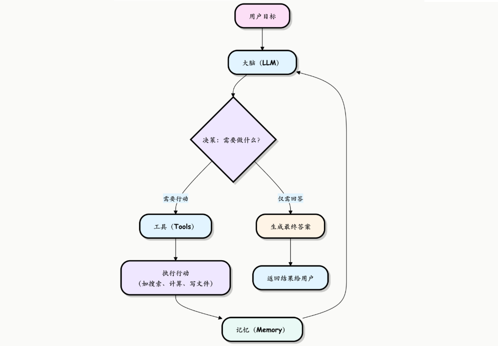

# Vibe Coding Token 降本优化推荐
面向 AI 代码开发 Agent 的全链路 Token 优化技能集推荐，完整解析 Agent、Skill 底层原理与四大轻量化优化方案，降低大模型调用成本

## 目录
- 什么是Agent？
- 介绍什么是Skill？
- Token消耗逻辑是什么？
- 四个 Vibe Coding Token Optimization Skills，包括 Headroom, RTK, Ponytail, Caveman.

## 什么是 Agent？

Agent 是以 LLM 为核心大脑的自主执行主体，具备**目标理解、任务规划、工具调用、状态管理、反思纠错**的完整能力闭环，可以主动推进复杂任务直至完成。

#### **核心组成：**

- **大脑 (The Brain) - 大语言模型 (LLM)**
LLM 是 Agent 的决策中心和推理引擎，用于理解用户输入的目标和上下文，分析当前状况，然后决定下一步该做什么——是直接回答问题，还是调用某个工具？它负责规划和分解复杂任务。

- **工具 (Tools) - 可执行的动作**
Tools 是 Agent 的手和脚，是其能力的延伸，使用一个个具体的函数或 API，让 Agent 能够与外部世界互动。

- **记忆 (Memory) - 对话与经验的存储**
Memory 用于记录工作过程，保证任务的连贯性。
其中，短期记忆保存当前对话的历史；长期记忆存储更持久的信息（例如用户偏好、历史任务结果）。

** 大脑负责思考，工具负责行动，记忆保证连贯，三者缺一不可。 **

#### **工作原理：**

1. **感知**：①接收用户的任务；②读取当前环境状态，组装上下文（项目文件、终端输出、历史上下文）

2. **规划**：LLM 将复杂目标拆解为多步可执行的子任务，生成执行计划；

3. **决策**：Agent 根据当前状态判断下一步动作（读取文件、修改代码、执行命令、调用工具 / Skill）

4. **执行**：调用对应的工具或 Skill 完成动作，获取执行结果（搜索、API、测试等）

5. **反思校验**：检查结果是否符合目标，①符合要求则生成最终输出；②不符合要求则循环优化



#### **核心特征：**
- **自主性**：无需人类逐步指导，可主动推进任务
- **状态记忆**：拥有短期上下文记忆和长期工作记忆
- **工具调度**：可以自主选择并调用工具、Skill 来完成任务
- **纠错能力**：能根据执行结果反思问题，自行修正方案

## 什么是 Skill？

Skill 是封装**垂直专业规则、操作指令、参考资源、配套脚本**的能力包，载体为包含 skill.md 配置文件的独立文件夹。

#### **工作原理：**
1.**扫描匹配（Discovery）**：对话开始时，Agent 扫描所有可用的 Skill 元数据（名称、功能描述、触发条件）。这是最轻量的信息，足以让 Agent 判断某个技能是否可能与当前任务相关

2.**自动加载（Activation）**：当用户请求与 Skill 的描述语义匹配时，Agent 会自动将完整的 Skill 文件内容加载到上下文中。这时 Agent 会读取完整的指令和说明

3.**规则执行（Execution）**： Agent 底层的 LLM 理解 Skill 中的规则后，会按照规则约束自己的行为，完成对应任务。这时 Agent 会调用 Skill 附带的脚本、读取参考资料或使用其他资源

#### **核心特征：**
- **被动触发**：Skill 本身不具备自主决策能力，必须由 Agent 加载后才能生效
- **可插拔复用**：一个 Skill 可以被任意 Agent 加载使用
- **垂直专精**：单个 Skill 通常只解决一类特定问题

#### ** Skill 与 Agent 的区别**
Agent 是执行任务的「主体 / 指挥官」，Skill 是给 Agent 用的「能力插件 / 操作手册」

| 主体 | 定位 | 角色比喻 |
|------|------|------|
| Agent | 自主执行主体、任务调度中心 | 指挥官 / 执行者 |
| Skill | 标准化能力插件、操作约束手册 | 专用工具 / 说明书 |

## Token消耗逻辑是什么？

**Token**：大模型文本切分后的最小处理单元，既是算力单元，也是计费单元。

通用计费公式：**单次请求成本 = 输入 Token × 输入单价 + 输出 Token × 输出单价**

#### **API 请求的两个底层阶段：**

1. **Prefill（预填充 / 读阶段）**
模型一次性并行处理全部输入文本，构建 KV 缓存；对应**输入 Token**

2. **Decode（解码 / 写阶段）**
自回归逐 Token 生成回复，无法并行；对应**输出 Token**，算力开销更大

#### **普通对话 VS Agent 循环**

- **普通单次对话**（一问一答）：
 - **输入 Token** = 系统提示词 + 已加载 Skill 规则 + 全量历史对话 + 用户最新提问
 - **输出 Token** = 模型单次返回文本

- **Agent 循环**（Vibe Coding）：
 - 任务闭环链路：用户需求 → LLM思考 → 调用工具(readFile/git/run shell) → 工具返回大量结果 → 结果塞进上下文 → 再次调用LLM → 继续规划/调用工具 → 循环直到任务完成

#### **Agent 场景成本滚雪球的根源**
**所有工具返回内容永久留在上下文，每一轮请求都要重复读取全部历史数据！**
```javascript
举例：
Agent 读取一份 5000 Token 源码文件，后续还要执行 15 轮工具循环，这就导致这份 5000 Token 源码文件会在后续 15 次 LLM 调用全部重复作为输入，进而产生的额外消耗 ≈ 5000 × 15 = 75000 Token。
```

#### **Token消耗核心环节**：

- 上下文读取：约 50%（最大开销来源）

- 工具返回结果处理：约 30%

- 最终内容生成输出：约 20%

## Vibe Coding Token Optimization Skills

### **1. Headroom**
- **Github地址：**https://github.com/headroomlabs-ai/headroom
- **作用层级：**上下文组装 / 全局输入层
- **核心作用：**压缩上下文信息（文件内容、日志、历史对话、RAG结果...），让 AI 少阅读一些内容
- **Token 节约比例：**
 - Coding Agent 场景减少 15%-20%
 - JSON 结构化数据场景减少 60-95%
- **使用场景：**大型项目、长时间对话、多文件修改等输入 Token 占比极高的场景
- **弊端：**极端压缩可能产生上下文信息失真

### **2. RTK**

- **Github地址：**https://github.com/rtk-ai/rtk
- **作用层级：**工具执行 / 终端命令输出层
- **核心作用：**压缩大模型产生的bash信息，过滤掉git、search、test和build的输出，只保留关键错误和摘要，减少终端的垃圾信息
- **Token 节约比例：**常见开发命令：60-90%
- **使用场景：**日常开发、Debug、大规模自动化测试
- **弊端：**规则死板，有误删调试日志风险，可能隐藏关键日志

### **3. Ponytail**

- **Github地址：**https://github.com/DietrichGebert/ponytail
- **作用层级：**模型规划 / 代码生成输出层
- **核心作用：**改变AI写代码逻辑，优先复用现有代码、标准库、原生能力，减少重复开发
- **Token 节约比例：**代码量减少50%，Token节约20%
- **使用场景：**CRUD、UI小功能、简单改动
- **弊端：**容易牺牲代码健壮性与可维护性，大型任务会降智

### **4. Caveman**

- **Github地址：**https://github.com/JuliusBrussee/caveman
- **作用层级：**最终输出 / 自然语言输出层
- **核心作用：**简化 Agent 的输出，仅保留核心信息，避免过度解释
- **Token 节约比例：**平均减少65%-75%输出Token
- **使用场景：**高频调用、仅需结果、成本敏感场景
- **弊端：**丢失推理说明，不利于学习与复杂问题复盘

#### **串联：四个 Skill 如何从链路拦截 Token 消耗**

1. RTK 拦截终端命令输出，过滤无效日志噪音
2. 各类工具返回文件/日志，Headroom 统一压缩全部输入
3. LLM 接收精简上下文进入生成阶段，Ponytail 控制代码输出质量
4. Caveman 压缩话术，大幅降低输出 Token
5. 将生成结果存入新一轮上下文，完成全链路节流

#### **总结：**
| Skill | 适用场景 | 推荐星级 |
|------|------|------|
| RTK | 日常开发、调试、跑测试命令 | ★★★★★ |
| Headroom | 长会话、大型多文件项目开发 | ★★★★☆ |
| Ponytail | 简单 CRUD、小型功能迭代、减少冗余代码 | ★★★★☆ |
| Caveman | 高频调用、只需要最终结果、严格控成本 | ★★★☆☆ |


=======================最后=======================

**推荐博主：飞天闪客**
