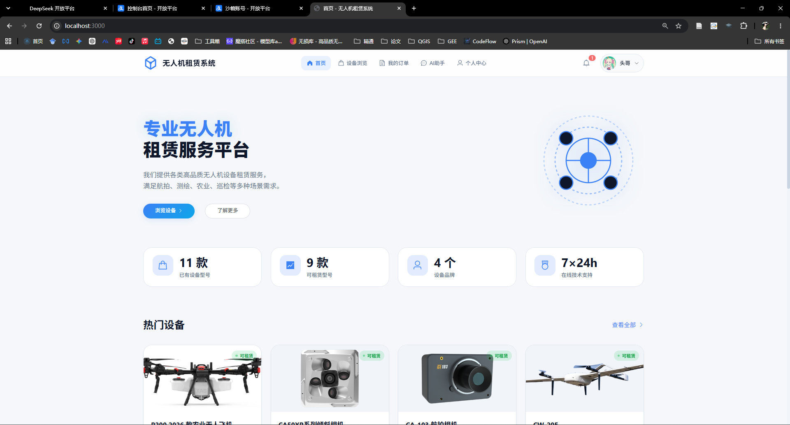
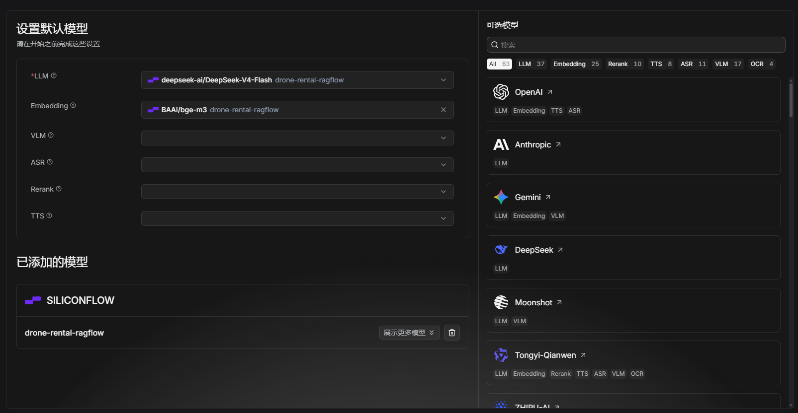
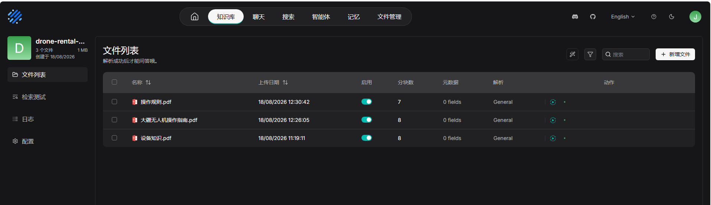

# Drone-Rental
一个无人机租赁系统的全栈开发记录 and Vibe Coding.

目前已实现：用户租赁、资质审核、空域备案、支付宝支付、物流状态、归还评价、故障报修、维修工单、实时通知、 AI 智能助手、RAGFlow…… 

更多功能边学习边添加。 😜

# 技术栈
      前端：Vue 3、Vite 5、Element Plus、Echarts
      
      后端：Python 3.11、FastAPI 0.116、Uvicorn REST API、OpenAPI、SSE 和 WebSocket。
      
      数据库：MySQL

AI 模型接口：deepseek-v4-flash

支持支付接口：alipay

安全技术：JWT、BCrypt、CORS、限流……

# 目标
项目业务原型参考开源仓库：[Drone-Rental-System](https://github.com/springmeng/Drone-Rental-System)

⚠️ 重要说明：原型采用Java开发，本项目基于Python独立重构实现，未复用原项目源代码，仅借鉴无人机租赁业务流程与系统需求设计思路。

项目目标：
1. 梳理并优化租赁、归还、运维、结算等无人机租赁完整业务闭环，修复原型缺陷，完善系统功能；
2. 集成智能体系统，赋能智能客服、订单智能分配、设备状态监控、风险预警、自动化工单流转；
3. 开展架构优化、系统安全与生产环境适配工作，实现一套支持商业化部署的智能化无人机租赁解决方案；
4. 项目中学习主流的 Vibe Coding Knowledge。

# 功能更新记录

2026/08/12

完善了订单生命周期、退租结算和退款服务，具体包括：

0. 整理了数据库的初始化 sql 文件 **init.sql**。

1. 调整管理后台故障报修、维保、评价、订单、无人机和资质审核页面的表格布局与列对齐。
   
    关键技术：**Vue 3 Composition API** 与 **Element Plus 表格组件**

2. 完善“我的订单”状态分类筛选功能，并补充“已退款”分类，明确待发货订单的退款权限。
   
    关键技术：使用 **Vue** 响应式状态维护订单分类，前端状态值与后端订单状态**枚举对应**，通过状态参数调用**分页接口**完成分类筛选。

3. 为数据库补充缺失的发货时间和收货时间字段，并在订单详情时间线中展示具体操作时间。
   
    关键技术：使用 MySQL DATETIME 字段和 SQLAlchemy ORM 保存 **ship_time、receive_time** 等业务时间。

4. 下单时将无人机当前押金保存为订单押金快照。
   
    关键技术：采用**订单数据快照设计**，在创建订单时将无人机当前押金复制到订单的 **deposit_amount** 字段

5. 用户支付租金和押金的合计金额，并保存真实支付记录、支付方式和支付时间。
   
    关键技术：使用 Decimal 进行金额计算，支付金额按照“**租金总额 + 订单押金快照**”生成；通过**独立支付表**记录金额、渠道、状态和支付时间。
   
6. 修复原型中虚假的30分钟支付有效期，并使用支付宝订单同步传入绝对失效时间进行安全校验。
   
   关键技术：后端根据订单创建时间计算固定支付截止时间，并通过支付宝 **alipay.trade.page.pay** 的 **time_expire** 参数传递**绝对失效时间**。

7. 后端定期扫描超时未支付订单，自动取消订单并恢复无人机库存。支付接口、支付宝创建接口和支付回调都会再次检查截止时间，避免超时支付和并发竞态。

   关键技术：使用 **FastAPI 生命周期**和 **asyncio 后台任务**定期扫描超时订单；通过 **SQLAlchemy事务**、**数据库悲观锁** SELECT ... FOR UPDATE 和**支付接口二次校验**解决超时支付、重复取消及库存恢复竞态。
  
8. 更新订单状态流转中间态为：租赁中、用户申请退租、待归还/待寄回、用户填写寄回物流、待商家收货、管理员验机并结算押金、已归还。

   关键技术：通过**后端服务层**校验当前状态，只允许执行合法的退租申请、寄回物流和验机结算操作。**有限状态机思想**

9. 管理员确认归还时，可以无扣除退还全部押金，也可以填写扣除金额和原因后退还剩余押金。

   关键技术：使用 **Pydantic DTO** 校验押金扣除金额和原因，精确计算“押金退款 = 押金快照 − 扣除金额”，由后端统一执行结算。

10. 买家提前寄回无人机时，以提交寄回物流的日期计算实际使用天数，寄回当天计费，并退还剩余未使用天数的租金。提前归还的租金退款和押金退款合并执行一次真实渠道退款，同时分别记录租金和押金结算明细。（若无人机在确认收货当天因故障寄回，并且关联故障已经由管理员审核确认，则租金和押金全部退还，实际计费天数为零。普通当天退租仍收取一天租金；待审核或被判定为“非故障”的报修不会触发全额退款。）

    关键技术：使用**日期差值**计算实际计费天数和未使用天数，以**寄回物流时间**作为归还依据；通过**订单关联的故障报修记录**及**审核状态**判定故障全额退款，并将租金退款和押金退款合并为一次渠道退款。

11. 管理员确认结算后，订单流转为“已归还”，恢复无人机库存，记录归还审计日志并向用户发送结算通知。

    关键技术：使用**数据库事务**将订单状态更新、库存恢复、押金结算、归还审计日志和用户通知作为**同一业务**操作处理，保证状态一致性。

12. 管理员对已支付但尚未发货的订单执行退款时，可以退还全部实付金额，订单流转为“已退款”并恢复库存。

    关键技术： 通过**订单状态校验限制**只有“已支付、待发货”订单可以全额退款，并在退款成功后更新订单状态、支付状态和设备库存。

13. 支付宝模式下调用真实退款接口，并校验退款结果和金额；模拟支付模式下同步维护本地退款状态。

    关键技术：使用**支付宝 RSA2 签名接入 alipay.trade.refund 真实退款接口**，并校验支付宝返回的退款金额；未启用支付宝时使用模拟支付逻辑维护本地支付与退款状态。

14. 支付渠道退款失败时，不更新本地订单、押金、库存和退款状态。

    关键技术： 采用“**先渠道退款、后本地落库**”的处理顺序。支付渠道抛出异常或返回金额不一致时立即终止事务，不更新订单、押金、支付状态和库存。

15. 同一笔订单不能重复执行提前归还租金退款、押金退款和故障全额退款。

    关键技术：使用**订单行锁、状态前置条件、押金结算状态以及支付累计退款金额**进行幂等控制，防止重复全额退款、重复押金结算和超额退款。

16. 用户订单详情展示预计或已完成的提前归还租金退款、押金退款和故障全额退款结果。

    关键技术： **后端订单 VO 统一返回**计费天数、未使用天数、租金退款、押金退款、押金扣除和故障全额退款标识；Vue 根据结算状态展示“预计退款”或“已退款”明细。

===========================================================

2026/08/16

1. 更新设备浏览状态展示，默认列表现在展示所有已上架设备，包括可租赁、缺货和维护中的设备。

   关键技术：Vue

2. 分析 MCP、DeepSeek Chat Completions API、Function/Tool Calling 和 RAGFlow 的职责与调用流程。
   
   DeepSeek Chat Completions API 负责模型推理；Function Calling 负责让模型选择工具；MCP 负责标准化工具发现与调用；RAGFlow 负责知识库检索增强。

3. 建立符合标准的 Streamable HTTP MCP 服务

   关键技术：使用 官方 Python MCP SDK、FastMCP、Streamable HTTP、Bearer Token、DNS Rebinding 防护、Host/Origin 白名单，在 /mcp/ 暴露标准 MCP 服务。

4. 在 MCP 内部调用中安全传递当前业务用户身份。

   关键技术：后端 MCP Client 使用 短期 JWT 用户上下文 Token和 MCP _meta 元数据传递 user_id、会话 ID；MCP Server 验证签名后执行用户订单、资质、空域等个性化查询。

5. 使用 MCP Inspector 进行完整 MCP 验证流程。

   关键技术：使用 MCP Inspector 检查 tools/list 和 tools/call，Vue AI 助手验证端到端问答，管理端 AI 工具日志核对工具名、参数、输出和耗时；通过错误 MCP 地址进行故障注入，确认系统没有静默回退。

6. 优化全部 7 个 AI/MCP 工具的描述、参数 Schema 和执行逻辑。

7. 优化无人机型号模糊匹配，并避免短品牌词误选具体设备。

   关键技术：实现 文本归一化、大小写无关匹配、空格和分隔符清理、SQL 部分匹配及中英文品牌别名组，使 DJI、dji、大疆、DJI 大疆 和 DJI大疆 能够命中同一品牌。此外，同时匹配多个型号时返回歧义提示，要求用户补充完整型号。

8. 当前发给模型的上下文组成：基础系统提示词和工具规则 + 当前用户重要度最高的 10 条长期记忆（AI 记忆管理） + 会话摘要 + 当前会话最近 10 条记录 + 经过 RAGFlow 增强的当前问题（未来加入）

         - 用户记忆：ai_memory，跨会话、手工维护，最多注入 10 条。
         
         - 会话历史：ai_chat_trace，按 session_id 隔离，向模型提供最近 10 条记录。
         
         - 对话摘要：不是模型生成的摘要，而是根据“租赁、故障、资质、价格”和少数 DJI 系列关键词形成的规则摘要。
         
         - RAGFlow：根据当前问题检索最多 3 个知识片段，再附加到当前用户问题中。

===========================================================

2026/08/18

   实现了 RAGFlow 服务的使用。

   RAGFlow 是一款基于深层文档理解的开源 RAG（检索增强生成）引擎。与大语言模型（LLM）结合，它能够提供真实可靠的问答能力，并从各种复杂格式的数据中提供有据可查的引用。<a href="https://ragflow.com.cn/docs" target="_blank">RAGFlow</a>

   说白了，RAGFlow 给大模型装上 “私人资料库查阅功能”，RAG 负责管理你的私有知识库，帮大模型实时查阅你的内部文件，让 AI 基于你提供的资料回答问题，而不是靠它自身的记忆凭空猜想。RAGFlow 属于一种增强模块。

1. 部署 Docker WSL 具体方法见：<a href="docs/Docker WSL Install.txt" target="_blank">Docker WSL Install</a>

   对于 RAGFlow 的设置，采用 SiliconFlow + BGE-M3（主要免费），架构为：

         Vue 前端 → PyCharm：drone-rental-python → Docker Desktop：RAGFlow → SiliconFlow：BAAI/bge-m3 Embedding → DeepSeek V4 Flash：最终回答、工具调用

   

3. RAGFlow 配置管理（由 Pydantic Settings 自动从项目根目录 .env 读取）

         AI_RAGFLOW_ENABLED = 控制是否启用 RAG
         
         AI_RAGFLOW_BASE_URL= 配置 RAGFlow API 地址
         
         AI_RAGFLOW_API_KEY = 用于 Bearer 鉴权
         
         AI_RAGFLOW_DATASET_IDS = 支持一个或多个知识库 ID

4. 获取知识库列表的请求格式：
{
  "id": "知识库ID",
  "name": "知识库名称",
  "doc_num": 3
}

5. 知识库检索的请求格式：
{
  "question": "用户问题",
  "dataset_ids": ["知识库ID"],
  "page": 1,
  "page_size": 3
}

6. 构造知识库上下文的方法，检索到的片段会被组合为：

         【知识库参考信息】
         
         [1] 第一段检索内容
         
         [2] 第二段检索内容
         
         [3] 第三段检索内容
         
         用户问题: 原始用户问题

然后将增强后的问题发送给 DeepSeek。

关键点：1.RAGFlow 只负责检索。   2.DeepSeek V4 Flash 继续负责最终回答。   3.不需要在 RAGFlow 中配置额外 Chat 模型。   4.普通对话和流式对话都支持 RAG。   5.项目没有用 RAGFlow 查询实时业务数据（避免了把易变化的数据库数据写进向量知识库）。

6. 编写三份独立、适合导入 RAGFlow 的 测试知识文档
- 操作规则：涵盖注册认证、租赁流程、支付、订单状态、归还退款及故障申报。
- 设备知识：整理项目实际设备、价格、押金、库存、应用场景、参数解释与选型建议。
- 大疆无人机操作指南：针对项目中的六款大疆设备整理安全操作、飞行检查、异常处置及机型差异。

7. RAGFlow 配置的本地方案：Docker Ollama + bge-m3，适合需要完全本地存储数据的场景。

# 特别说明
Code and Vibe Coding Knowledge 正在整理中...

The complete code will be released upon completion.
